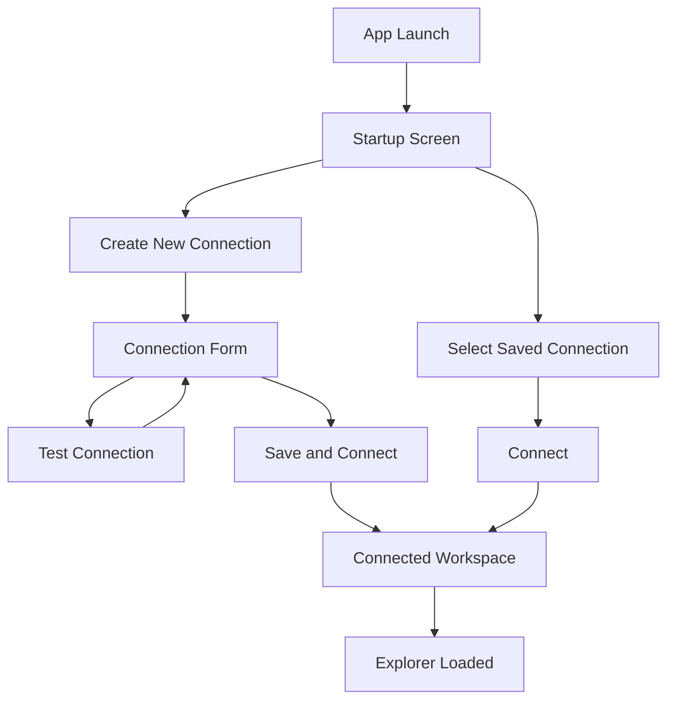
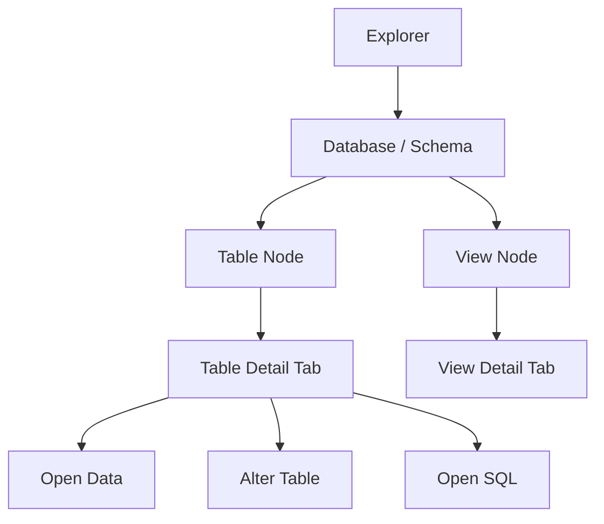
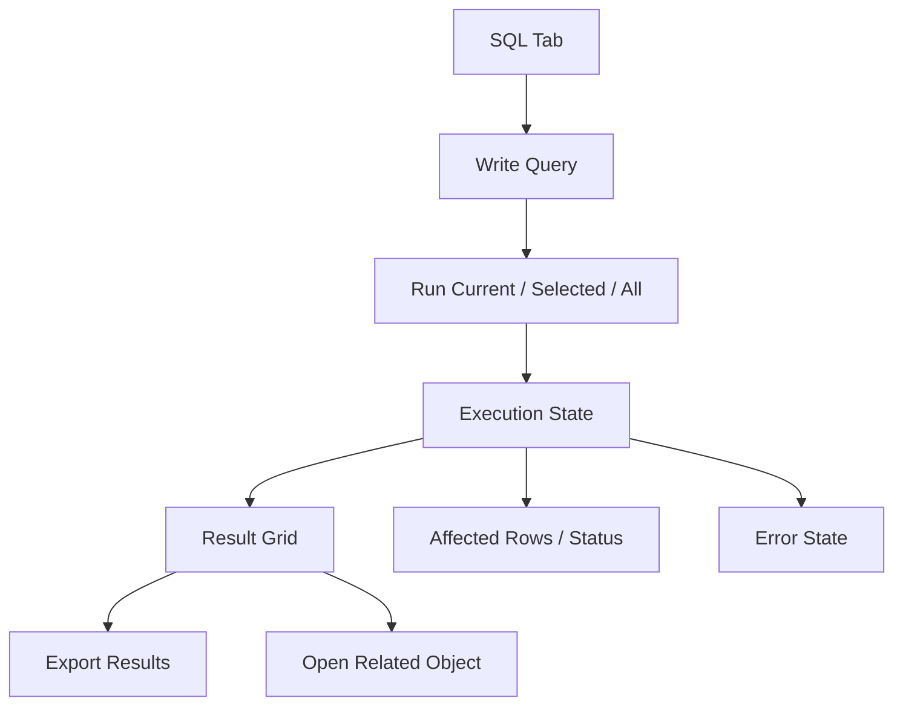
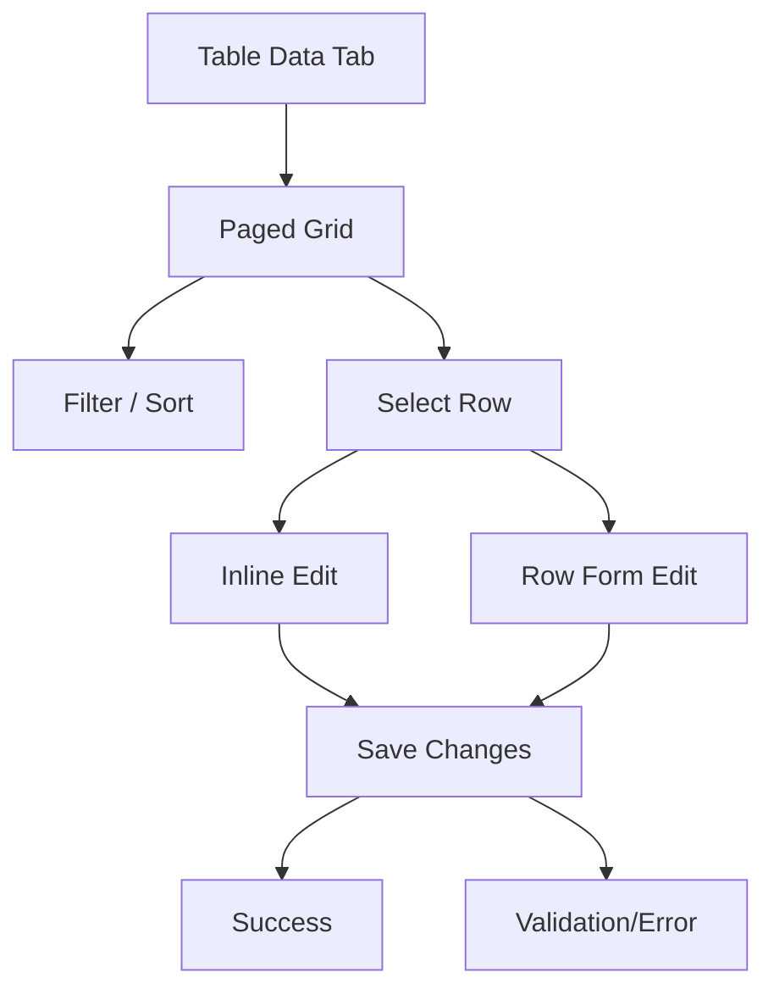
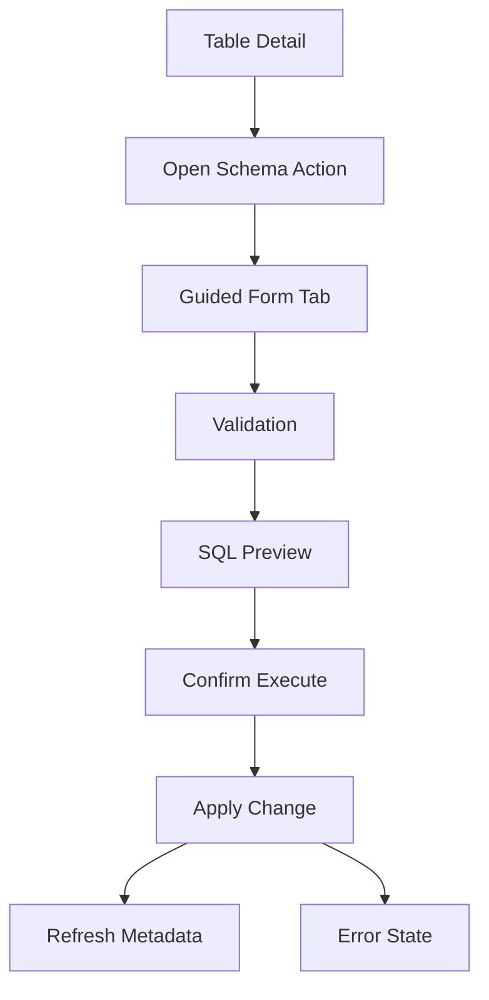

# Adminer Desktop UX Spec and Wireflow v2

## 1. Document Control

- Product: Adminer Desktop
- Version: v2
- Date: 2026-03-23
- Status: Revised Draft
- Source BRD: [`adminer-desktop-brd-v2.md`](/Users/purwaren/Projects/tools/adminer-desktop/docs/adminer-desktop-brd-v2.md)
- Source FRD: [`adminer-desktop-frd-v2.md`](/Users/purwaren/Projects/tools/adminer-desktop/docs/adminer-desktop-frd-v2.md)
- Source Technical Design: [`adminer-desktop-technical-design-v2.md`](/Users/purwaren/Projects/tools/adminer-desktop/docs/adminer-desktop-technical-design-v2.md)
- Prior Version: [`adminer-desktop-ux-spec-wireflow.md`](/Users/purwaren/Projects/tools/adminer-desktop/docs/adminer-desktop-ux-spec-wireflow.md)
- Critique: [`adminer-desktop-ux-spec-critique.md`](/Users/purwaren/Projects/tools/adminer-desktop/docs/adminer-desktop-ux-spec-critique.md)

## 2. Purpose

This document defines the revised user experience model and primary wireflows for Adminer Desktop v1. It narrows the UX baseline for launch, clarifies editing patterns, adds stronger accessibility and responsive rules, and makes the main flows easier to validate.

## 3. Revision Summary

Compared with v1, this version:

- separates MVP-critical UX from broader v1 surfaces
- clarifies when editing happens inline versus in a row form
- defines preferred surface types for core actions
- adds responsive and focus-management guidance
- adds acceptable v1 simplifications
- makes edge states more explicit for each major journey

## 4. UX Goals

- Make common PostgreSQL/MySQL workflows feel immediate
- Reduce the distance between exploration and action
- Keep powerful tools visible without overwhelming new users
- Make production and destructive states unmistakable
- Preserve confidence through context, feedback, and SQL transparency

## 5. UX Principles

- Browse first, act second
- Show context before controls
- Prefer progressive disclosure over clutter
- Make risk visible before execution
- Keep experts fast without making beginners unsafe
- Never hide the active environment or read-only status
- Prefer fewer stronger interaction patterns over many inconsistent ones

## 6. UX Priority Tiers

## 6.1 MVP-Critical Surfaces

These flows must be designed first and validated earliest:

- startup and connection management
- connected shell and explorer
- SQL editor and results
- table data browsing
- row edit and insert
- schema edit with SQL preview
- destructive confirmation

## 6.2 Core v1 Supporting Surfaces

- import/export
- session/process list
- runtime metadata
- blocked/unsupported states

## 6.3 Deferred UX Depth

- advanced multi-step workspace orchestration
- rich diagnostics dashboards
- highly customized power-user layouts

## 7. Personas and UX Priorities

## 7.1 Backend Developer

Priorities:

- fast connection switching
- fast SQL execution
- easy schema inspection
- quick row verification/edit

## 7.2 Technical Operator

Priorities:

- clear environment status
- strong destructive guardrails
- reliable session/process visibility
- clear export and diagnostics flows

## 7.3 Power User / Small-Team DBA

Priorities:

- keyboard efficiency
- low-friction navigation between explorer, SQL, and data
- visible SQL preview for changes
- confidence in safety behaviors

## 8. Information Architecture

The app should use a three-level structure:

1. app shell
2. work context
3. task surfaces

## 8.1 App Shell

Persistent regions:

- left sidebar: connections and explorer
- top context bar: active session, environment, database/schema, read-only badge
- center workspace: tabs and main content
- bottom or inline status region: jobs, progress, completion, and failure summaries

## 8.2 Primary Working Areas

- Connections
- Explorer
- SQL
- Results/Data
- Operations

These are coordinated workspace surfaces, not separate products.

## 8.3 Required Shell Behaviors

- the user must always know which connection/session is active
- the user must always be able to tell whether the session is production-labeled or read-only
- a running background job must not block normal browsing unless the current task requires exclusive focus

## 9. Surface Type Rules

To reduce inconsistency, v1 should use only four main surface types:

- persistent shell regions
- main workspace tabs
- side panels/drawers
- dialogs

### Preferred Uses

- tabs: SQL editors, table/view details, table data, import/export flows, operations
- side panels/drawers: row forms, object details supplement, session detail
- dialogs: destructive confirmations, lightweight blocking confirmations, connection delete confirmation

### Avoid in v1

- deep modal chains
- wizard stacks that hide surrounding context unnecessarily
- mixing multiple editing paradigms for the same task without a clear rule

## 10. Editing Pattern Rules

## 10.1 Data Editing

Use a hybrid model with explicit primary/secondary behavior.

Primary behavior:

- row-form editing in a side drawer or structured panel

Secondary behavior:

- inline quick edit only for simple scalar cells when:
- the row is writable
- the column type is simple
- validation is straightforward

Rules:

- inserts always use row-form editing
- complex values use row-form editing
- inline edit should not be the only path to save changes

## 10.2 Schema Editing

Schema editing must use guided forms in a workspace tab.

Rules:

- object edit begins from a detail tab or explorer action
- the edit surface opens in a dedicated tab, not a nested modal
- SQL preview appears in a confirmation step before execution
- destructive schema actions use elevated confirmation where needed

## 10.3 Operations Actions

Session termination and similar operational actions should start from an operations tab and confirm in a dialog with target identity shown clearly.

## 11. Screen Inventory

## 11.1 MVP-Critical Screens

1. startup / connection screen
2. create/edit connection form
3. connected explorer shell
4. SQL editor tab
5. results panel
6. table detail tab
7. table data tab
8. schema edit tab
9. destructive confirmation dialog

## 11.2 Supporting v1 Screens

10. view detail tab
11. import flow
12. export flow
13. session/process list tab
14. runtime metadata panel
15. read-only blocked action notice

## 12. Global Shell Specification

## 12.1 Left Sidebar

Sections:

- saved connections
- favorites
- active explorer

Behavior:

- collapsed mode available
- if disconnected, the explorer must clearly show disconnected state rather than silently disappearing

## 12.2 Top Context Bar

Must show:

- active connection name
- engine type
- current database
- current schema if supported
- environment label
- read-only status

Behavior:

- production uses a stronger warning treatment
- read-only badge is persistent
- on narrow layouts, lower-priority context may collapse into a secondary details menu, but environment and read-only state must remain visible

## 12.3 Tab Bar

Supports:

- multiple task tabs
- close tab
- dirty-state indicator for unsaved SQL editors

v1 simplification:

- no custom tab grouping or advanced split-view management required

## 12.4 Status and Job Region

Must surface:

- running query
- import/export progress
- metadata loading when useful
- completion/failure summaries

v1 simplification:

- a simple job tray or bottom status region is acceptable
- no complex background-job dashboard required in v1

## 13. Required Global States

All major screens must support these states where applicable:

- loading
- empty
- error
- disconnected
- unsupported
- permission blocked

Rules:

- each state must explain what happened
- each recoverable state should expose the next useful action
- unsupported and permission-blocked must be distinct from generic failure

## 14. Core User Journeys and Wireflows

## 14.1 Journey A: First Open to Connected Explorer

Goal:

- move the user from launch to a usable connected workspace with minimal friction

### Flow

1. user opens app
2. app shows connection-centric startup screen
3. user selects saved connection or starts new one
4. user tests connection if needed
5. user connects
6. explorer loads
7. workspace shows quick-start context

### Wireflow

### Edge States

- no saved connections
- failed test connection
- failed connect
- partial metadata load failure

### Acceptance Guidance

- primary CTA is always obvious
- connection errors are actionable
- success state makes the next likely action visible

## 14.2 Journey B: Connect and Explore Schema

Goal:

- browse structure quickly and open useful tabs without losing context

### Flow

1. user expands database/schema in explorer
2. user selects table or view
3. app opens detail tab
4. user jumps to data, SQL, or schema action

### Wireflow

### Edge States

- empty schema
- permission-blocked object
- disconnected explorer
- unsupported object type in v1

### Acceptance Guidance

- explorer stays responsive while lazy loading
- opening one object does not destroy other tabs

## 14.3 Journey C: Run SQL and Inspect Results

Goal:

- support quick ad hoc query execution and longer working sessions

### Flow

1. user opens SQL tab
2. user writes or pastes SQL
3. user runs current statement, selection, or full editor
4. results appear in result panel
5. user exports, reruns, edits, or opens related object

### Wireflow

### Edge States

- long-running query
- cancel requested
- query error
- disconnected during execution
- blocked write SQL in read-only mode

### Acceptance Guidance

- editor content remains visible after execution
- result states clearly distinguish rows returned vs affected rows vs error

## 14.4 Journey D: Browse and Edit Table Data

Goal:

- make row inspection easy while keeping edits explicit and safe

### Flow

1. user opens table data tab
2. app loads paged rows
3. user filters or sorts
4. user edits inline or opens row form
5. user reviews and saves changes
6. app confirms success or shows validation errors

### Wireflow

### Edge States

- empty table
- table not writable
- permission blocked
- row save validation failure
- disconnected during save

### Acceptance Guidance

- browsing remains usable even when editing is disabled
- inserts and complex edits use the row form
- clone and delete are secondary actions

## 14.5 Journey E: Change Schema with SQL Preview

Goal:

- make schema changes understandable and clearly intentional

### Flow

1. user opens schema action
2. user edits guided form
3. app validates form
4. app generates SQL preview
5. user confirms
6. app executes
7. metadata refreshes and outcome is shown

### Wireflow

### Edge States

- unsupported change type
- invalid form input
- non-transactional warning
- permission blocked
- execution failure after preview

### Acceptance Guidance

- schema changes never skip SQL preview
- non-transactional actions are labeled clearly before execute

## 14.6 Journey F: Import SQL or CSV

Goal:

- make import controlled and observable rather than opaque

### SQL Import Flow

1. user opens import flow
2. user selects file
3. user reviews execution options
4. user confirms import
5. progress and failures stream to UI
6. completion summary is shown

### CSV/TSV Import Flow

1. user opens import to table
2. user selects file
3. app reads header/sample
4. user maps columns
5. app validates mapping
6. user confirms import
7. progress and summary are shown

### Edge States

- unreadable file
- invalid format
- mapping validation failure
- partial import failure
- disconnected during import

### Acceptance Guidance

- import always has a preflight step
- summary distinguishes validation failure from execution failure

## 14.7 Journey G: Inspect Sessions and Kill Session

Goal:

- let operators resolve live issues without ambiguity

### Flow

1. user opens operations tab
2. app loads active sessions
3. user selects session
4. details panel shows metadata
5. user chooses `Kill Session`
6. confirmation dialog appears
7. app executes and refreshes list

### Acceptance Guidance

- target session identity is always shown before confirm
- production-labeled sessions use elevated confirmation

## 15. Screen Specifications

## 15.1 Startup / Connection Screen

Primary content:

- saved connections
- favorites
- new connection CTA

Primary actions:

- connect
- new connection
- edit
- favorite
- delete

v1 simplification:

- no need for a highly customized landing dashboard

## 15.2 Connection Form

Required fields:

- profile name
- engine
- host
- port
- username

Optional/advanced fields:

- password
- default database
- SSL/TLS settings
- environment label
- read-only mode

Primary actions:

- test connection
- save
- save and connect

## 15.3 Explorer

Interaction model:

- single click selects
- explicit open action or double click opens in tab
- search filters current scope

Keyboard expectations:

- arrow keys move tree selection
- enter opens selected object

## 15.4 Table Detail Tab

Recommended structure:

- object header
- summary metadata
- columns section
- indexes section
- foreign keys section
- actions bar

## 15.5 SQL Editor Tab

Recommended structure:

- tab toolbar
- editor
- result/status region

Primary actions:

- run current
- run selected
- run all
- cancel
- export

## 15.6 Table Data Tab

Recommended structure:

- object header with write-state indicator
- filter bar
- grid
- row action toolbar
- pagination or load more

## 15.7 Schema Edit Tab

Required sections:

- editable form fields
- validation messages
- generated SQL preview step
- execute confirmation step

## 15.8 Import Flow

Preferred structure:

1. file selection
2. validation/preflight
3. mapping or execution options
4. progress
5. summary

## 15.9 Operations Tab

Recommended structure:

- session list
- details side panel
- refresh action
- kill action

## 16. Confirmation and Safety UX

## 16.1 Confirmation Tiers

### Tier 1: Standard Confirm

Use for:

- non-production row delete
- lower-risk destructive actions outside production

### Tier 2: Elevated Confirm

Use for:

- production-labeled destructive actions
- truncate
- kill session
- non-transactional schema changes

Pattern:

- target identity
- environment label
- consequence text
- stronger user acknowledgement

## 16.2 Read-Only UX

When read-only mode is active:

- show persistent badge
- disable write and destructive controls
- block write SQL with clear explanation
- provide recovery guidance when appropriate

## 17. Focus and Keyboard Rules

## 17.1 Focus Management

- opening a dialog moves focus into the dialog
- closing a dialog returns focus to the triggering control when practical
- opening a new tab should place focus in the tab’s primary interactive surface
- after failed validation, focus should move to the first actionable error when appropriate

## 17.2 Keyboard Expectations

Minimum v1 expectations:

- `Cmd/Ctrl + Enter` runs the primary SQL action
- `Esc` closes lightweight dialogs when safe
- explorer is keyboard navigable
- forms have predictable tab order
- result and data surfaces expose keyboard-reachable primary actions

## 18. Responsive and Adaptive Rules

v1 is desktop-first, but narrower window sizes still need coherent behavior.

Rules:

- sidebar may collapse
- lower-priority context may compress into secondary affordances
- environment and read-only indicators must remain visible
- destructive confirmation dialogs must remain readable at narrow widths

## 19. Accessibility Guidance

Minimum v1 expectations:

- visible focus states
- keyboard-reachable primary workflows
- color not used as the only signal for risk
- confirmation buttons use clear language, not only color/icon
- status and errors available in text

## 20. Acceptable v1 Simplifications

To keep scope controlled, these are acceptable in v1:

- simple job/status region instead of a full background jobs center
- constrained data-grid interactions
- limited workspace customization
- straightforward operations tab rather than a rich admin console
- one strong schema-edit flow instead of many specialized editing variants

## 21. UX Risks

- overloading the shell with too many actions
- making the data grid behave like a spreadsheet
- too much safety friction in non-production
- weak distinction between blocked, unsupported, and failed
- losing clarity on smaller window sizes

## 22. Recommended Next UX Artifacts

Create next:

1. low-fidelity wireframes for MVP-critical screens
2. component inventory for badges, dialogs, headers, state panels, and toolbars
3. annotated interaction notes for row editing, schema preview, and destructive confirmation

## 23. Summary

Adminer Desktop v1 should feel like a focused database workbench with three dominant qualities:

- always clear about context
- always fast to inspect and query
- always explicit before risk

The revised UX model deliberately narrows interaction complexity so the first release can feel coherent, safe, and buildable rather than broad but inconsistent.
